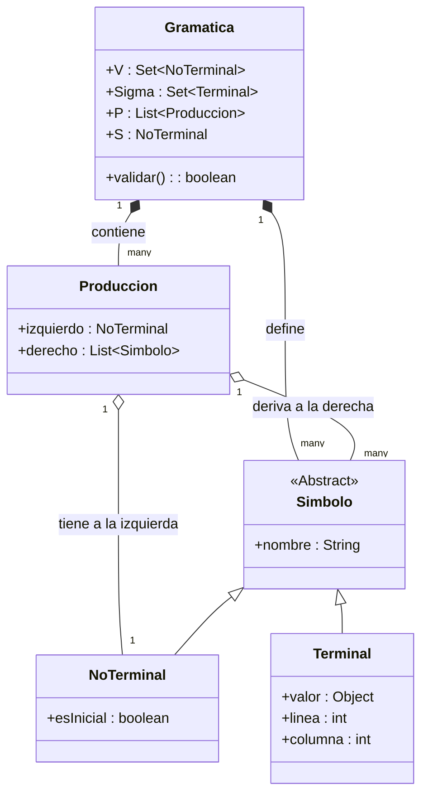

# INFORME TÉCNICO: INTÉRPRETE DE COMANDOS PARA ROVER ESPACIAL
**Asignatura:** Teoría de Autómatas y Compiladores  
**Institución:** Universidad Nacional de Loja (UNL)  
**Prácticas:** Práctica 9 (Diseño Conceptual) y Práctica 10 (Implementación)

---

## ENTREGABLE 1: DOCUMENTACIÓN PARA EL INFORME

### 1. DISEÑO ABSTRACTO (FASE A - PRÁCTICA 9)

#### Tabla de Definición de Entidades
La siguiente tabla formaliza los componentes lógicos que estructuran la gramática libre de contexto del intérprete del Rover Espacial:

| Entidad | Descripción | Atributos principales | Restricciones / Reglas de Integridad |
| :--- | :--- | :--- | :--- |
| **Terminal (Símbolo)** | Unidad mínima e indivisible (token) producida por el lexer que no puede ser descompuesta. | `nombre`, `valor_semantico`, `fila`, `columna` | No puede aparecer en el lado izquierdo de ninguna producción de la gramática libre de contexto. |
| **No Terminal (Variable)** | Símbolo abstracto de la gramática que representa una categoría sintáctica o estructura compuesta. | `nombre`, `valor_retorno_semantico` | Debe poder derivar en una secuencia de terminales (condición de productividad); no debe generar ciclos infinitos no productivos. |
| **Producción (Regla)** | Regla de derivación que define cómo un No Terminal se sustituye por una secuencia de terminales y/o no terminales. | `no_terminal_izq` (LHS), `secuencia_der` (RHS) | El lado izquierdo debe contener exactamente un único No Terminal (restricción de gramáticas libres de contexto). |
| **Gramática (GLC)** | Tupla formal de cuatro elementos que define por completo el lenguaje de comandos estructurado. | $V$ (No Terminales), $\Sigma$ (Terminales), $P$ (Producciones), $S$ (Símbolo inicial) | Los conjuntos $V$ y $\Sigma$ deben ser finitos y disjuntos ($V \cap \Sigma = \emptyset$). El símbolo inicial $S$ debe pertenecer a $V$. |

#### Diagrama de Clases / Entidades de la Gramática (Mermaid.js)
El siguiente diagrama representa la composición de la gramática y el flujo de los objetos involucrados en el proceso de traducción:

---

### 2. VALIDACIÓN E INSTANCIACIÓN (FASE B - PRÁCTICA 9)

#### Tabla de Símbolos del Contexto del Rover

##### Terminales (Alfabeto $\Sigma$)
| Token | Descripción / Rol | Atributos semánticos asociados |
| :--- | :--- | :--- |
| **MOVE** | Palabra clave para indicar comando de traslación. | Ninguno |
| **FORWARD** | Dirección de movimiento adelante. | Ninguno |
| **BACKWARD** | Dirección de movimiento atrás. | Ninguno |
| **LEFT** | Dirección de giro izquierda. | Ninguno |
| **RIGHT** | Dirección de giro derecha. | Ninguno |
| **TURN** | Palabra clave para indicar comando de rotación. | Ninguno |
| **TAKE** | Palabra clave para recolectar. | Ninguno |
| **SAMPLE** | Palabra clave que representa el objeto recolectado (muestra). | Ninguno |
| **FROM** | Preposición de origen del terreno. | Ninguno |
| **SOIL** | Terreno tipo suelo/tierra. | Ninguno |
| **ROCK** | Terreno tipo roca. | Ninguno |
| **METERS** | Unidad de medida para traslación. | Ninguno |
| **DEGREES** | Unidad de medida para rotación. | Ninguno |
| **';' (PUNTO_COMA)** | Delimitador del fin de una instrucción. | Ninguno |
| **NUMERO** | Valor entero que representa distancia o ángulo. | `Integer` (valor numérico capturado) |

##### No Terminales (Variables $V$)
| No Terminal | Descripción Sintáctica | Tipo de retorno/valor semántico |
| :--- | :--- | :--- |
| **Prog** | Símbolo inicial que agrupa el flujo completo. | `Result` (Simulación y Árbol) |
| **ListaComandos** | Secuencia ordenada de instrucciones (recursiva a la izquierda). | `Result` (Simulación y Árbol acumulados) |
| **Comando** | Una instrucción individual válida del Rover. | `Result` (Simulación y Árbol individuales) |
| **Movimiento** | Estructura para comandos de avance o retroceso. | `Result` |
| **Giro** | Estructura para comandos de rotación. | `Result` |
| **Recoleccion** | Estructura para el comando de recolección de muestras. | `Result` |
| **Terreno** | Opciones válidas de suelo donde extraer muestras. | `Result` |
| **DirMov** | Opciones de dirección de avance. | `Result` |
| **DirGiro** | Opciones de dirección de giro. | `Result` |

#### Tabla de Producciones de la Gramática
Definición formal y paso a paso de las reglas gramaticales (las acciones semánticas se encargan de acumular el árbol sintáctico indentado y las simulaciones en español):

1. **Prog** $\rightarrow$ **ListaComandos**
2. **ListaComandos** $\rightarrow$ **ListaComandos** **Comando**
3. **ListaComandos** $\rightarrow$ **Comando**
4. **Comando** $\rightarrow$ **Movimiento** `;`
5. **Comando** $\rightarrow$ **Giro** `;`
6. **Comando** $\rightarrow$ **Recoleccion** `;`
7. **Movimiento** $\rightarrow$ `MOVE` **DirMov** `NUMERO` `METERS`
8. **Giro** $\rightarrow$ `TURN` **DirGiro** `NUMERO` `DEGREES`
9. **Recoleccion** $\rightarrow$ `TAKE` `SAMPLE` `FROM` **Terreno**
10. **DirMov** $\rightarrow$ `FORWARD`
11. **DirMov** $\rightarrow$ `BACKWARD`
12. **DirGiro** $\rightarrow$ `LEFT`
13. **DirGiro** $\rightarrow$ `RIGHT`
14. **Terreno** $\rightarrow$ `SOIL`
15. **Terreno** $\rightarrow$ `ROCK`

#### Definición Formal de la Gramática
La gramática formal para el intérprete del Rover Espacial se define como la cuádrupla $G = (V, \Sigma, P, S)$, donde:

- **$V$ (No Terminales):**  
  $V = \{\text{Prog}, \text{ListaComandos}, \text{Comando}, \text{Movimiento}, \text{Giro}, \text{Recoleccion}, \text{Terreno}, \text{DirMov}, \text{DirGiro}\}$

- **$\Sigma$ (Terminales):**  
  $\Sigma = \{\text{MOVE}, \text{FORWARD}, \text{BACKWARD}, \text{LEFT}, \text{RIGHT}, \text{TURN}, \text{TAKE}, \text{SAMPLE}, \text{FROM}, \text{SOIL}, \text{ROCK}, \text{METERS}, \text{DEGREES}, \text{';'}, \text{NUMERO}\}$

- **$P$ (Producciones):**  
  Conjunto de 15 producciones detalladas en el apartado anterior.

- **$S$ (Símbolo Inicial):**  
  $S = \text{Prog}$

---

### 3. RESPUESTAS A LAS PREGUNTAS DE CONTROL DE LA PRÁCTICA 9

1. **¿Por qué el analizador léxico (Lexer) solo ve símbolos terminales y no tiene conocimiento de los no terminales?**  
   *Respuesta:* El Lexer opera en la fase de análisis lineal (léxico), cuyo único propósito es agrupar secuencias de caracteres en componentes léxicos básicos (tokens o símbolos terminales) usando autómatas finitos. Los no terminales pertenecen a la fase sintáctica superior; son construcciones abstractas definidas por una gramática libre de contexto que determinan la jerarquía de las sentencias y que solo el Parser (mediante un autómata de pila) puede comprender y procesar.
   
2. **¿Cuál es el peligro de representar el lado derecho de una producción como un conjunto desordenado en lugar de una secuencia ordenada en el parser?**  
   *Respuesta:* Las producciones de una gramática libre de contexto especifican cadenas ordenadas ($V \cup \Sigma)^*$. Si el lado derecho se tratara como un conjunto sin orden, se perdería la sintaxis lineal del lenguaje. Un parser determinista (LL o LR) no podría predecir qué camino tomar ni validar el orden correcto de las instrucciones. Comandos válidos como `MOVE FORWARD 10 METERS;` se confundirían con combinaciones erróneas de los mismos tokens, como `METERS 10 FORWARD MOVE ;`, comprometiendo la validez del compilador.

3. **¿Cómo se puede modificar una regla de producción para rechazar la presencia de un símbolo terminal en el lado izquierdo?**  
   *Respuesta:* En las Gramáticas Libres de Contexto (tipo 2 en la jerarquía de Chomsky), el lado izquierdo de cualquier producción debe constar estrictamente de un único símbolo no terminal. Para impedir que aparezca un símbolo terminal a la izquierda, las herramientas de generación sintáctica imponen reglas metasintácticas rígidas en la definición del archivo `.cup` u homólogos. De este modo, la sintaxis del lenguaje de descripción de gramáticas restringe la declaración izquierda a un identificador no terminal: `NoTerminal ::= Lado_Derecho`.

4. **¿Cómo se representan las producciones épsilon ($\epsilon$) en la tabla de producciones y cómo las interpreta el parser sintáctico?**  
   *Respuesta:* En la tabla de producciones, una regla épsilon ($\epsilon$) se representa dejando en blanco la secuencia del lado derecho (ej. `A ::= /* vacío */`). En tiempo de ejecución, el parser sintáctico utiliza los conjuntos de predicción `FOLLOW(A)`. Si el parser intenta reducir o expandir `A` y el token actual está dentro del conjunto de tokens que pueden seguir a `A`, el parser aplica la regla vacía sin consumir ningún símbolo de la entrada, permitiendo que la pila transicione de forma segura al siguiente estado sintáctico.

---

### 4. RESPUESTAS A LAS PREGUNTAS DE CONTROL DE LA PRÁCTICA 10

1. **¿Cómo se comunican el Lexer y el Parser en un compilador desarrollado con JFlex y CUP en Java?**  
   *Respuesta:* Se comunican mediante la interfaz `java_cup.runtime.Scanner`. El parser (consumidor) llama repetidamente al método `next_token()` del lexer (productor). JFlex genera dicho método, el cual escanea los caracteres de entrada del lector de texto, clasifica el lexema coincidente y retorna un objeto de tipo `java_cup.runtime.Symbol` con el código numérico del token y su información posicional o semántica.

2. **¿Cuál es el propósito de la clase `java_cup.runtime.Symbol` en la integración de CUP?**  
   *Respuesta:* La clase `Symbol` es el contenedor de paso de datos entre el lexer y el parser. Posee variables de instancia cruciales:
   - `sym`: Entero que identifica el tipo de terminal definido en la clase `sym.java`.
   - `left`: Fila del código donde inicia el lexema (1-indexed en nuestra configuración).
   - `right`: Columna del código donde inicia el lexema.
   - `value`: Un objeto `Object` que encapsula el valor semántico del token (como el texto de una cadena o el valor numérico de un `Integer`).

3. **¿Cómo se gestionan los tokens no definidos (errores léxicos) en el archivo `.flex` para que no interrumpan abruptamente la ejecución?**  
   *Respuesta:* Se gestionan agregando una regla por defecto al final de las reglas de escaneo, usualmente representada por el comodín `[^]`. Esta regla captura cualquier carácter ilegal e instancia un lanzamiento controlado de excepción (`throw new RuntimeException("Error léxico: Carácter ilegal '...' en línea X, columna Y")`). Esta excepción es capturada en la GUI (`VentanaPrincipal.java`) por un bloque `try-catch`, mostrando el error de manera ordenada en la pantalla de salida sin detener la máquina virtual de Java.

4. **¿De qué manera CUP permite pasar valores semánticos desde las reglas subordinadas a las producciones de nivel superior?**  
   *Respuesta:* CUP utiliza el etiquetado de símbolos en las producciones (ej: `NUMERO:n` o `Terreno:t`). El parser asocia los valores de estas etiquetas a variables disponibles en la ejecución de la acción semántica. Al resolver la producción de abajo hacia arriba en la pila sintáctica, el desarrollador calcula el resultado y lo asigna a la variable especial `RESULT` (ej: `RESULT = new Result(...)`). Este valor se pasa automáticamente como el atributo `value` del no terminal padre.

5. **¿Qué es el flujo de tokens (token stream) y cómo lo procesa el parser sintáctico para construir el árbol de derivación?**  
   *Respuesta:* El flujo de tokens es la secuencia lineal ordenada de símbolos terminales que el lexer va entregando a demanda. El parser lo procesa utilizando un autómata LALR(1) que realiza operaciones de **desplazamiento** (guardar tokens en la pila) y **reducción** (sustituir los tokens por el no terminal correspondiente cuando se reconoce una regla gramatical). En cada reducción, las acciones semánticas construyen los nodos del árbol de derivación sintáctica en base a los árboles de los subcomponentes.

6. **Describe el ciclo de vida completo desde que el usuario ingresa una cadena en la interfaz hasta que se muestra el resultado.**  
   *Respuesta:*
   1. El usuario digita el texto de comandos en la caja de texto `inputArea` y pulsa "Analizar Comandos".
   2. El manejador del botón lee el texto y crea un flujo de entrada `StringReader`.
   3. Se inicializa el `Lexer` pasándole el reader, y luego el `parser` alimentado por el `Lexer`.
   4. Se invoca el método `parser.parse()`.
   5. El parser interactúa con el lexer solicitando símbolos mediante `next_token()`.
   6. Si el lexer halla caracteres extraños, interrumpe el análisis lanzando una excepción de error léxico.
   7. Si la secuencia de tokens rompe las reglas sintácticas, la función `syntax_error()` lanza una excepción detallando el token inesperado y la posición.
   8. Si la entrada es válida, las producciones se reducen con éxito, construyendo el árbol XML y traduciendo los comandos a un registro en español. El parser retorna un objeto `Symbol` cuyo atributo `value` es el objeto `Result`.
   9. El bloque `try-catch` captura el éxito o el error y actualiza los `JTextArea` de la pantalla con las salidas formateadas.

7. **¿Cuáles son los errores de integración más comunes entre JFlex y CUP y cómo se solucionan?**  
   *Respuesta:*
   - *Inconsistencia de nombres*: Ocurre si CUP genera los identificadores en la clase `sym.java` pero el lexer busca los enteros en una clase con diferente capitalización (como `Sym.java`). Se soluciona forzando el mismo nombre de clase en el compilador.
   - *Ausencia del runtime de CUP*: Ocurre si no se enlaza el JAR `java-cup-runtime.jar` en la fase de compilación o ejecución, lanzando excepciones `ClassNotFoundException`. Se resuelve configurando adecuadamente el Classpath (`-cp`).
   - *Desfases en la posición de línea y columna*: Cuando el parser indica posiciones erróneas. Se corrige activando las opciones `%line` y `%column` en JFlex y pasando `yyline + 1` y `yycolumn + 1` en el constructor de `Symbol`.

---

### 5. CONCLUSIONES Y BIBLIOGRAFÍA

#### Conclusiones
1. **Separación de Concernientes (Separation of Concerns):** El uso conjunto de herramientas formales como JFlex (generador léxico) y Java CUP (generador sintáctico LALR) demuestra la eficiencia de desacoplar el análisis de bajo nivel (lexemas) del análisis gramatical de alto nivel, permitiendo un mantenimiento limpio y escalable del código.
2. **Importancia del Análisis Semántico Guiado por la Sintaxis:** La inclusión de acciones semánticas integradas en las reglas de derivación permitió resolver simultáneamente dos tareas: la traducción/simulación de los comandos del Rover al idioma español y la construcción dinámica del Árbol de Derivación Sintáctica, demostrando que la fase sintáctica es el lugar ideal para estructurar la semántica de un lenguaje de programación.
3. **Manejo de Errores como Factor de Calidad:** La personalización en la detección de fallos léxicos y sintácticos garantiza una experiencia de usuario superior, permitiendo a los operadores del Rover espacial saber exactamente en qué línea, columna y ante qué componente falló el comando transmitido.

#### Bibliografía
- Aho, A. V., Lam, M. S., Sethi, R., & Ullman, J. D. (2008). *Compiladores: Principios, técnicas y herramientas* (2.ª ed.). Pearson Educación.
- JFlex. (2023). *JFlex User's Manual* (v1.9.1). Recuperado de https://jflex.de/
- Hudson, S. E., & Flannery, F. (2016). *CUP LALR Parser Generator for Java*. Georgia Tech & Lafayette College. Recuperado de http://www2.cs.tum.edu/projects/cup/
- Universidad Nacional de Loja. (2026). *Guías de Prácticas de Laboratorio APE 9 y APE 10 - Teoría de Autómatas y Compiladores*. Carrera de Computación.
